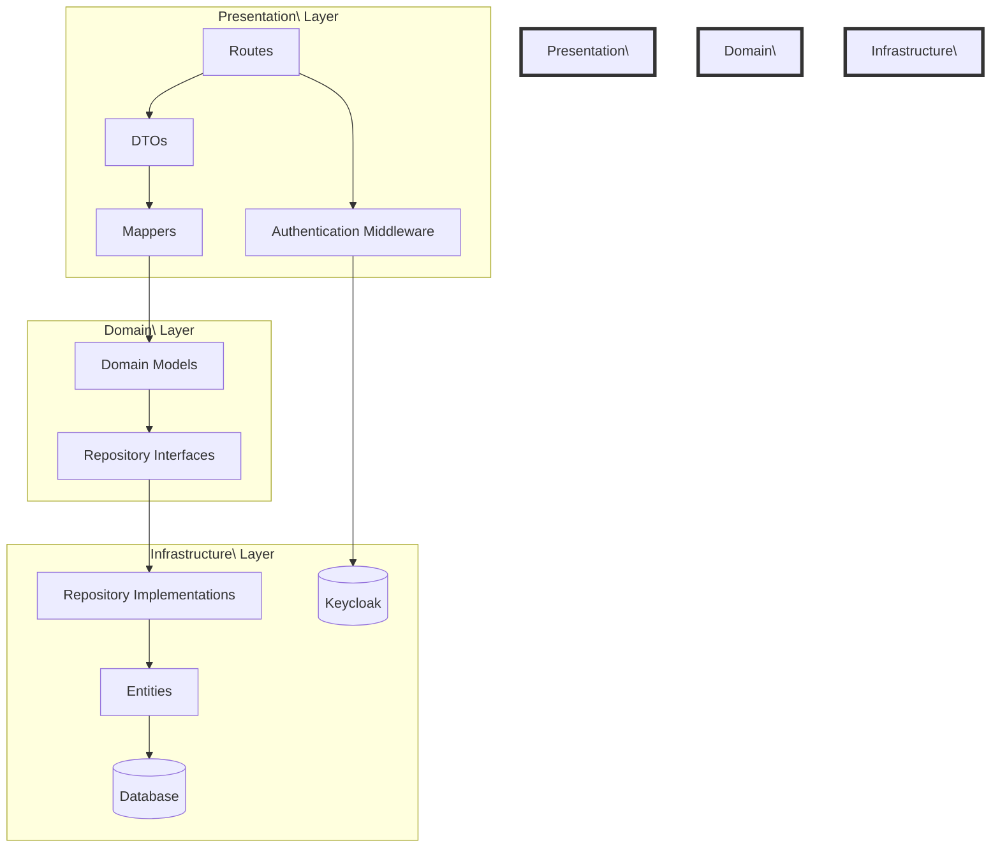
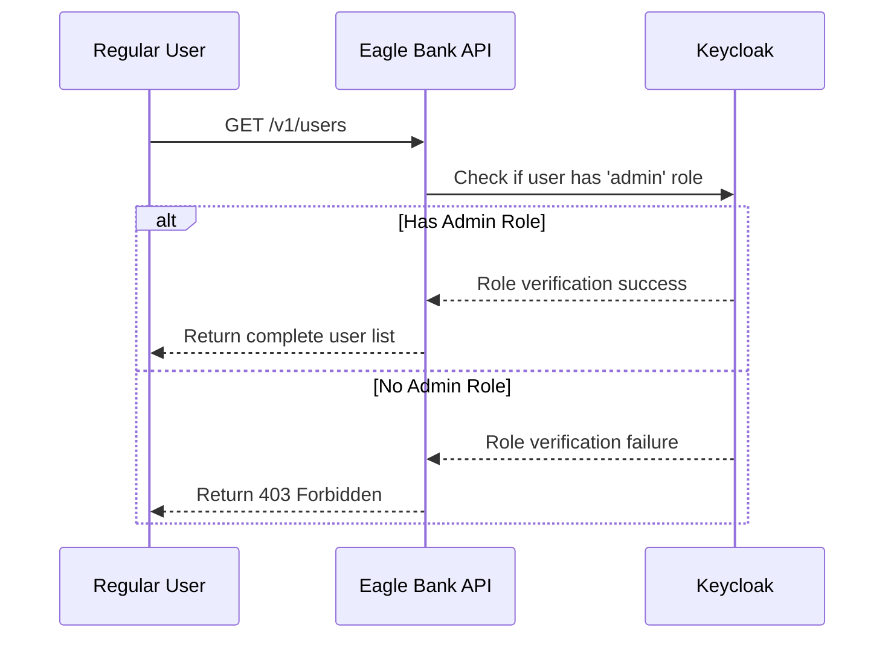
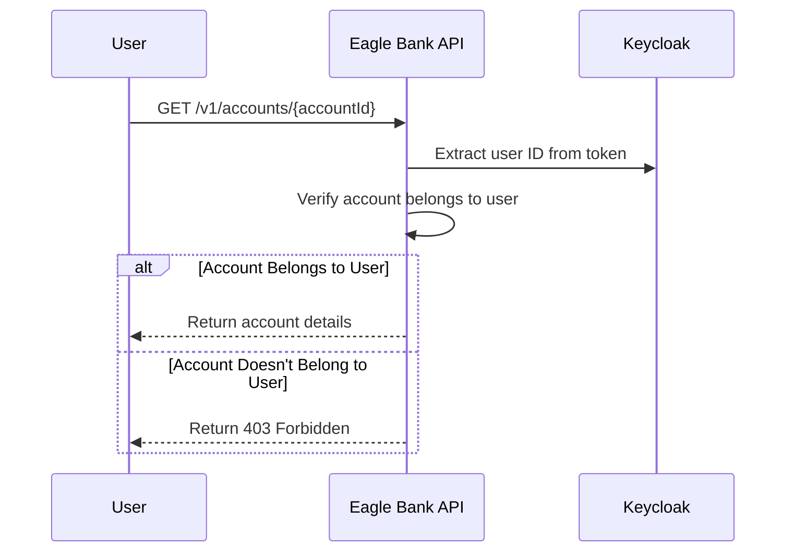

## Eagle Bank API

This project provides a foundational API for a banking application, built with Kotlin and Ktor. It demonstrates core backend functionalities, including user management with persistence, request validation, and JWT-based authentication.

## Table of Contents

- [Features](#features)
- [Planning](#planning)
- [Technologies Used](#technologies-used)
- [Installation and Setup](#installation-and-setup)
- [API Implementation Status](#api-implementation-status)
- [Technical Concerns](#technical-concerns)
- [Testing](#testing)
- [Configuration](#configuration)
- [Future Considerations](#future-considerations)
- [Contributing](#contributing)
- [License](#license)
- [Documentation](#documentation)

## Features

-   **User Management:** CRUD (Create, Read, Update, Delete) operations for user entities.
-   **Request Validation:** Basic validation for incoming API requests to ensure data integrity.
-   **JWT Authentication:** Secure access to protected API endpoints using JSON Web Tokens.
-   **Database Integration:** Uses an in-memory H2 database for development and testing, with a flexible design for other SQL databases.
-   **Ktor Framework:** Leverages Ktor's asynchronous and lightweight framework for building web applications.
-   **Dependency Injection:** Managed with Koin for easy service resolution and testability.
-   **Swagger/OpenAPI:** Automatic API documentation generation for easy exploration and testing of endpoints.

## Planning

The project follows a structured development plan with prioritized tasks across multiple areas:

- **Authentication & Security:** Keycloak integration, token validation, role-based access control
- **Infrastructure:** AWS setup, edge protection, monitoring & operations
- **User Management:** Data model updates, API endpoint implementation
- **Account Management:** Account creation, retrieval, updates, and deletion
- **Testing:** Integration tests, security testing, load testing
- **Documentation:** Setup guides, API documentation, deployment guidelines

For a detailed breakdown of planned tasks and their current status, see the [Planning List](PlanningList.md).

## Technologies Used

*   **Kotlin:** A modern, concise, and safe programming language for JVM.
*   **Ktor:** A flexible and asynchronous web framework for Kotlin.
*   **Koin:** A pragmatic lightweight dependency injection framework for Kotlin developers.
*   **H2 Database:** An in-memory relational database for development and testing.
* **Keycloak:** An open source identity and access management solution.
*   **Gradle:** Build automation tool.
*   **JUnit 5:** Testing framework.
*   **MockK:** Mocking library for Kotlin.

## Installation and Setup

For detailed installation and setup instructions, please refer to the [Setup Guide](docs/SETUP.md) in the docs folder.
This guide includes:

- Step-by-step installation instructions
- Configuration details
- Keycloak setup and usage
- Authentication information
- Test user credentials

The setup process involves:

1. Cloning the repository and setting up the Gradle wrapper
2. Configuring the application using HOCON configuration files
3. Setting up Keycloak using the provided scripts:
    - `./scripts/start-keycloak.sh` - Starts the Keycloak server
    - `./scripts/setup-keycloak-realm.sh` - Configures the realm and resources
    - `./scripts/stop-keycloak-server.sh` - Stops the Keycloak server

## Architecture

The application follows a clean architecture pattern with distinct layers:

### Layer Responsibilities

- **Presentation Layer**
  - Routes: Handle HTTP requests and responses
  - DTOs: Data Transfer Objects for API requests/responses
  - Mappers: Convert between DTOs and Domain Models

- **Domain Layer**
  - Domain Models: Core business entities
  - Repository Interfaces: Define data access contracts

- **Infrastructure Layer**
  - Repository Implementations: Concrete data access logic
  - Entities: Database model representations
  - Database: Actual data storage

### Data Flow

1. HTTP Request → Route
2. Route receives DTO
3. Mapper converts DTO to Domain Model
4. Domain Layer processes business logic
5. Repository Interface defines data access
6. Repository Implementation handles persistence
7. Entity maps to database structure
8. Response flows back through the layers

This architecture ensures:
- Separation of concerns
- Domain logic isolation
- Infrastructure independence
- Testability
- Maintainability

## API Implementation Status

The following table shows the current implementation status of the API endpoints defined in the OpenAPI specification:

### Implemented APIs

| Endpoint           | Method | Description       | Status        |
|--------------------|--------|-------------------|---------------|
| /v1/users          | POST   | Create a new user | ✅ Implemented |
| /v1/users/{userId} | GET    | Fetch user by ID  | ✅ Implemented |
| /v1/users/{userId} | PATCH  | Update user by ID | ✅ Implemented |
| /v1/users/{userId} | DELETE | Delete user by ID | ✅ Implemented |
| /v1/users          | GET    | List all users    | ✅ Implemented |

### Pending APIs

| Endpoint                                                  | Method | Description                                     | Status    |
|-----------------------------------------------------------|--------|-------------------------------------------------|-----------|
| /login                                                    | POST   | Authenticate user and obtain JWT tokens         | ⏳ Pending |
| /refresh-token                                            | POST   | Obtain a new access token using a refresh token | ⏳ Pending |
| /protected                                                | GET    | Access a protected resource                     | ⏳ Pending |
| /v1/accounts                                              | POST   | Create a new bank account                       | ⏳ Pending |
| /v1/accounts                                              | GET    | List accounts                                   | ⏳ Pending |
| /v1/accounts/{accountNumber}                              | GET    | Fetch account by account number                 | ⏳ Pending |
| /v1/accounts/{accountNumber}                              | PATCH  | Update account by account number                | ⏳ Pending |
| /v1/accounts/{accountNumber}                              | DELETE | Delete account by account number                | ⏳ Pending |
| /v1/accounts/{accountNumber}/transactions                 | POST   | Create a transaction                            | ⏳ Pending |
| /v1/accounts/{accountNumber}/transactions                 | GET    | List transactions                               | ⏳ Pending |
| /v1/accounts/{accountNumber}/transactions/{transactionId} | GET    | Fetch transaction by ID                         | ⏳ Pending |

For a detailed description of each API endpoint, refer to the OpenAPI specification in
`src/main/resources/api-contract.yml`.

## Technical Concerns

### SIEM Logging

Security Information and Event Management (SIEM) logging is essential for monitoring and analyzing security events.
Implementation considerations include:

- Integration with a SIEM solution (e.g., Splunk, ELK Stack)
- Structured logging format for security events
- Logging of authentication attempts, access control decisions, and sensitive operations
- Compliance with regulatory requirements for log retention and protection

### OpenTelemetry

OpenTelemetry provides a standardized way to collect and export telemetry data:

- Distributed tracing across microservices
- Metrics collection for performance monitoring
- Context propagation between services
- Integration with observability backends (e.g., Jaeger, Prometheus)

### Monitoring

A comprehensive monitoring strategy should include:

- Health checks for all services and dependencies
- Performance metrics (response times, throughput, error rates)
- Resource utilization (CPU, memory, disk, network)
- Business metrics (transaction volumes, user activity)
- Alerting and notification systems for critical issues
- Dashboards for real-time visibility

## Authentication with Keycloak

The application uses Keycloak for authentication and user management. Below is a diagram showing how API calls are
intercepted and routed through Keycloak:

```mermaid
sequenceDiagram
    participant Client
    participant API as Eagle Bank API
    participant Auth as Authentication Middleware
    participant Protected as Protected Endpoints
    participant KC as Keycloak Server

    Client->>KC: 1. Authenticate (username/password)
    KC-->>Client: 2. Return JWT token
    Client->>API: 3. API request with JWT token
    API->>Auth: 4. Intercept request
    Auth->>KC: 5. Validate token (using JWK)
    KC-->>Auth: 6. Token validation result

    alt Valid Token
        Auth->>Protected: 7a. Route to protected endpoint
        Protected-->>Client: 8a. Return response
    else Invalid Token
        Auth-->>Client: 7b. Return 401 Unauthorized
    end
```

### Why Keycloak?

There are several advantages to using Keycloak over implementing custom authentication:

1. **Centralized Identity Management** - Single source of truth for user identities across multiple applications
2. **Industry-Standard Security** - Implements OAuth 2.0 and OpenID Connect protocols
3. **Rich Feature Set** - User federation, social login, multi-factor authentication, and more
4. **Reduced Development Effort** - No need to implement complex security features from scratch
5. **Delegation of Security Concerns** - Security experts maintain Keycloak, reducing the risk of security
   vulnerabilities

### Role-Based Access Control for Preventing IDOR Attacks

Insecure Direct Object References (IDOR) are a type of access control vulnerability that occurs when an application uses
user-supplied input to access objects directly. Keycloak's role-based access control can be leveraged to prevent IDOR
attacks in the following ways:

#### User List Access Restriction

A common IDOR vulnerability is allowing regular users to access a complete list of all users in the system:

Implementation approach:

1. Define an 'admin' role in Keycloak
2. Assign this role to administrative users only
3. In the API endpoints that return lists of users, check for the 'admin' role in the JWT token
4. Return a 403 Forbidden error if the user doesn't have the required role

#### Account Access Restriction

When implementing account management features, it's critical to prevent users from accessing other users' accounts:

Implementation approach:

1. Store account ownership information in the database (which user owns which account)
2. Extract the user ID from the Keycloak JWT token for each request
3. Before returning account information, verify that the account belongs to the requesting user
4. For administrative functions, create specific roles (e.g., 'account-manager') that allow access to multiple accounts
5. Always log access attempts for security auditing

By implementing these role-based access controls with Keycloak, the application can effectively prevent IDOR
vulnerabilities and ensure that users can only access resources they are authorized to view or modify.

## Documentation

Additional documentation is available in the `docs` folder:

- [Setup Guide](docs/SETUP.md) - Detailed instructions for setting up and configuring the project
- [Keycloak Mapper Guide](docs/README-keycloak-mapper.md) - Guide for finding and checking the audience mapper in the
  Keycloak admin UI
- [Transaction System](docs/Transaction_System.md) - Documentation of the transaction system implementation
- [Security System](docs/Security_System.md) - Documentation of the security system implementation
- [User System](docs/User_System.md) - Documentation of the user management system implementation
- [Accounts System](docs/Accounts_System.md) - Documentation of the bank account management system implementation

For development planning and roadmap, see the [Planning List](PlanningList.md).

## Potential Improvements

### Transaction and Balance Handling

1. **Decimal Precision**: Replace `Double` with `BigDecimal` for all monetary values to prevent rounding
   errors [[1]](https://medium.com/@jecky999/formatting-currency-in-kotlin-locale-aware-approach-for-global-apps-1a4038a4489d).
   This is especially critical for:
    - Account balances
    - Transaction amounts
    - Currency conversion calculations

2. **Transaction Immutability**:
    - Implement database-level constraints to prevent modifications of transaction records
    - Select something like Quantum Ledger Database (QLDB) as the transaction log? Transparent, immutable,
      cryptographically verifiable transaction log. Too expensive?
    - Add version control for account balances
    - Implement event sourcing pattern for complete transaction history
    - Add double-entry accounting system for better audit trails

3. **Transaction Status Tracking**:
    - Add transaction status lifecycle (PENDING, COMPLETED, FAILED, REVERSED)
    - Include completion timestamps
    - Implement transaction reconciliation processes

4. **Performance Optimization**:
    - Add appropriate database indexes for frequent queries
    - Implement caching strategies for account balances
    - Consider using batch processing for high-volume transactions

5. **Audit and Compliance**:
    - Implement comprehensive transaction logging
    - Add support for regulatory reporting
    - Include transaction categorization for analysis

6. **Currency Support**:
    - Add multi-currency support
    - Implement exchange rate management
    - Handle currency conversion fees

7. **Error Handling**:
    - Implement robust error recovery mechanisms
    - Add transaction rollback support
    - Include detailed error logging

8. **Security Enhancements**:
    - Add transaction amount limits
    - Implement fraud detection mechanisms
    - Add additional authentication for large transactions

9. **API Improvements**:
    - Add bulk transaction support
    - Implement transaction scheduling
    - Add transaction search and filtering capabilities

10. **Monitoring and Alerts**:
    - Add balance threshold alerts
    - Implement transaction monitoring for suspicious activity
    - Add performance monitoring for transaction processing