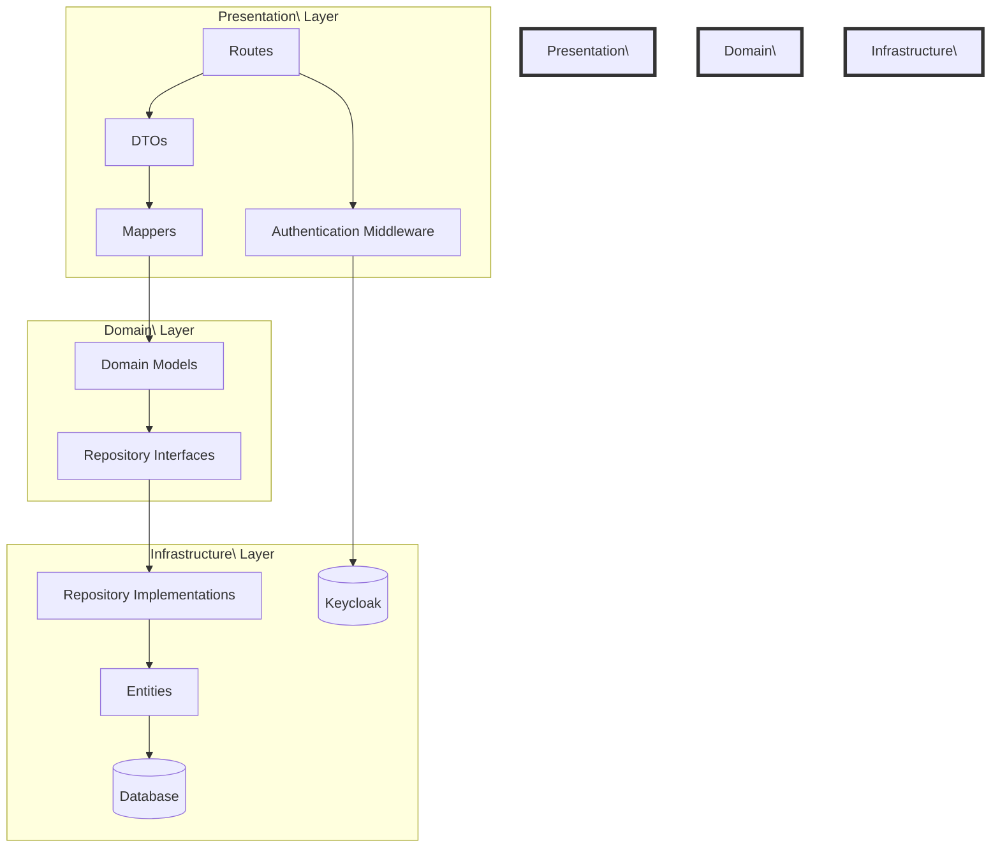
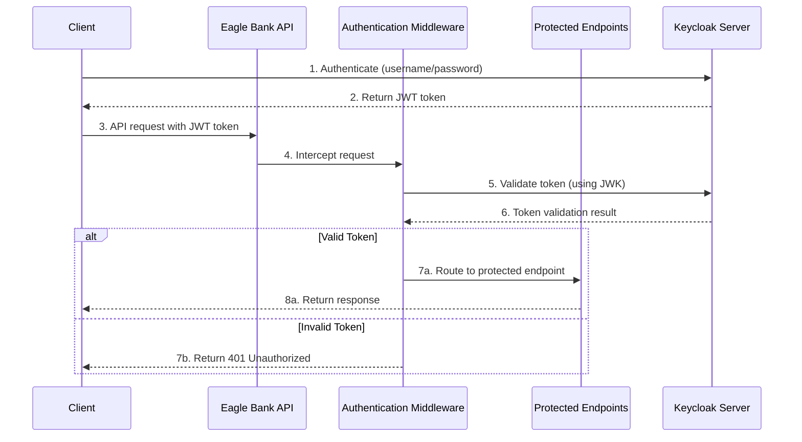
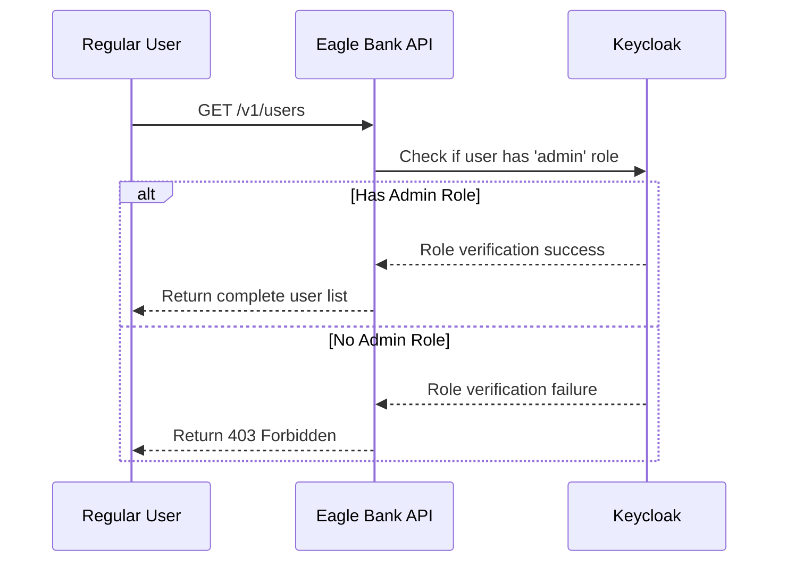
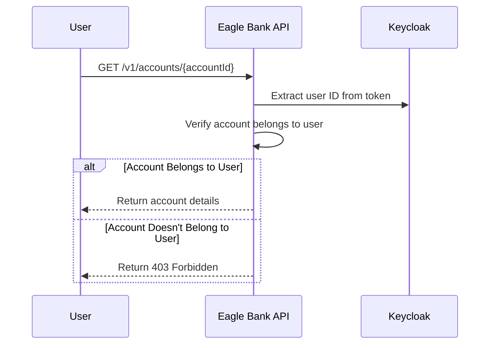

## Eagle Bank API

This project provides a foundational API for a banking application, built with Kotlin and Ktor. It demonstrates core backend functionalities, including user management with persistence, request validation, and JWT-based authentication.

## Table of Contents

- [Features](#features)
- [Planning](#planning)
- [Technologies Used](#technologies-used)
- [Installation and Setup](#installation-and-setup)
- [API Endpoints](#api-endpoints)
- [Testing](#testing)
- [Configuration](#configuration)
- [Future Considerations](#future-considerations)
- [Contributing](#contributing)
- [License](#license)
- [Documentation](#documentation)

## Features

-   **User Management:** CRUD (Create, Read, Update, Delete) operations for user entities.
-   **Request Validation:** Basic validation for incoming API requests to ensure data integrity.
-   **JWT Authentication:** Secure access to protected API endpoints using JSON Web Tokens.
-   **Database Integration:** Uses an in-memory H2 database for development and testing, with a flexible design for other SQL databases.
-   **Ktor Framework:** Leverages Ktor's asynchronous and lightweight framework for building web applications.
-   **Dependency Injection:** Managed with Koin for easy service resolution and testability.
-   **Swagger/OpenAPI:** Automatic API documentation generation for easy exploration and testing of endpoints.

## Planning

The project follows a structured development plan with prioritized tasks across multiple areas:

- **Authentication & Security:** Keycloak integration, token validation, role-based access control
- **Infrastructure:** AWS setup, edge protection, monitoring & operations
- **User Management:** Data model updates, API endpoint implementation
- **Account Management:** Account creation, retrieval, updates, and deletion
- **Testing:** Integration tests, security testing, load testing
- **Documentation:** Setup guides, API documentation, deployment guidelines

For a detailed breakdown of planned tasks and their current status, see the [Planning List](PlanningList.md).

## Technologies Used

*   **Kotlin:** A modern, concise, and safe programming language for JVM.
*   **Ktor:** A flexible and asynchronous web framework for Kotlin.
*   **Koin:** A pragmatic lightweight dependency injection framework for Kotlin developers.
*   **H2 Database:** An in-memory relational database for development and testing.
* **Keycloak:** An open source identity and access management solution.
*   **Gradle:** Build automation tool.
*   **JUnit 5:** Testing framework.
*   **MockK:** Mocking library for Kotlin.

## Installation and Setup

For detailed installation and setup instructions, please refer to the [Setup Guide](docs/SETUP.md) in the docs folder.
This guide includes:

- Step-by-step installation instructions
- Configuration details
- Keycloak setup and usage
- Authentication information
- Test user credentials

The setup process involves:

1. Cloning the repository and setting up the Gradle wrapper
2. Configuring the application using HOCON configuration files
3. Setting up Keycloak using the provided scripts:
    - `./scripts/start-keycloak.sh` - Starts the Keycloak server
    - `./scripts/setup-keycloak-realm.sh` - Configures the realm and resources
    - `./scripts/stop-keycloak-server.sh` - Stops the Keycloak server

## Architecture

The application follows a clean architecture pattern with distinct layers:

### Layer Responsibilities

- **Presentation Layer**
  - Routes: Handle HTTP requests and responses
  - DTOs: Data Transfer Objects for API requests/responses
  - Mappers: Convert between DTOs and Domain Models

- **Domain Layer**
  - Domain Models: Core business entities
  - Repository Interfaces: Define data access contracts

- **Infrastructure Layer**
  - Repository Implementations: Concrete data access logic
  - Entities: Database model representations
  - Database: Actual data storage

### Data Flow

1. HTTP Request → Route
2. Route receives DTO
3. Mapper converts DTO to Domain Model
4. Domain Layer processes business logic
5. Repository Interface defines data access
6. Repository Implementation handles persistence
7. Entity maps to database structure
8. Response flows back through the layers

This architecture ensures:
- Separation of concerns
- Domain logic isolation
- Infrastructure independence
- Testability
- Maintainability

## Authentication with Keycloak

The application uses Keycloak for authentication and user management. Below is a diagram showing how API calls are
intercepted and routed through Keycloak:

### Why Keycloak?

There are several advantages to using Keycloak over implementing custom authentication:

1. **Centralized Identity Management** - Single source of truth for user identities across multiple applications
2. **Industry-Standard Security** - Implements OAuth 2.0 and OpenID Connect protocols
3. **Rich Feature Set** - User federation, social login, multi-factor authentication, and more
4. **Reduced Development Effort** - No need to implement complex security features from scratch
5. **Delegation of Security Concerns** - Security experts maintain Keycloak, reducing the risk of security
   vulnerabilities

### Role-Based Access Control for Preventing IDOR Attacks

Insecure Direct Object References (IDOR) are a type of access control vulnerability that occurs when an application uses
user-supplied input to access objects directly. Keycloak's role-based access control can be leveraged to prevent IDOR
attacks in the following ways:

#### User List Access Restriction

A common IDOR vulnerability is allowing regular users to access a complete list of all users in the system:

Implementation approach:

1. Define an 'admin' role in Keycloak
2. Assign this role to administrative users only
3. In the API endpoints that return lists of users, check for the 'admin' role in the JWT token
4. Return a 403 Forbidden error if the user doesn't have the required role

#### Account Access Restriction

When implementing account management features, it's critical to prevent users from accessing other users' accounts:

Implementation approach:

1. Store account ownership information in the database (which user owns which account)
2. Extract the user ID from the Keycloak JWT token for each request
3. Before returning account information, verify that the account belongs to the requesting user
4. For administrative functions, create specific roles (e.g., 'account-manager') that allow access to multiple accounts
5. Always log access attempts for security auditing

By implementing these role-based access controls with Keycloak, the application can effectively prevent IDOR
vulnerabilities and ensure that users can only access resources they are authorized to view or modify.

## Documentation

Additional documentation is available in the `docs` folder:

- [Setup Guide](docs/SETUP.md) - Detailed instructions for setting up and configuring the project
- [Keycloak Mapper Guide](docs/README-keycloak-mapper.md) - Guide for finding and checking the audience mapper in the
  Keycloak admin UI

For development planning and roadmap, see the [Planning List](PlanningList.md).
